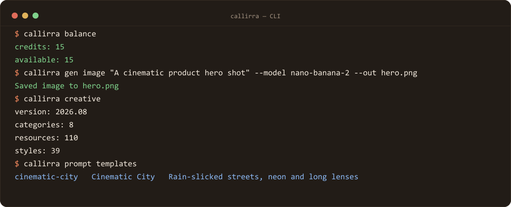

# @callirra/cli

[](https://www.npmjs.com/package/@callirra/cli)
[](#requirements)
[](#license)
[](https://callirra.com/api?utm_source=github-cli)

Official Callirra CLI — generate images and videos, browse 172 curated prompt recipes, and manage your account from the terminal. One API key for the newest image and video models.



> The prompt library ships with the package: `src/data/prompt-recipes.json` (172 recipes with their
> settings, credits and deep links) and `src/data/scene-recipes.json` (the six worked Seedance 2.5 scenes).
> They are generated from Callirra's own library by the monorepo's build, so the recipe commands work offline
> and need no API key. The browsable version is <https://callirra.com/seedance-prompt-library>.

## Requirements

> **The built-in template catalogue was retired (Sep 2026), and its commands went with it**: the endpoint
> answers an empty list, so `prompt templates` and `prompt enhance` could not work. They are replaced by
> `recipes`, `recipe <slug>` and `scenes` below, which read a snapshot of our own library shipped in the package.

- Node.js 22+
- A Callirra API key (`sk-cal-...`)

## Install

> **This repository is the standalone copy.** The CLI is developed inside the Callirra monorepo and
> mirrored here; `src/data/*.json` is generated from Callirra's own prompt library by the monorepo's
> `packages/mcp/scripts/build-data.mjs`, and is committed here so the package installs and runs on its own.

```bash
npm install -g @callirra/cli
# or
pnpm add -g @callirra/cli
```

Get an API key at [callirra.com](https://callirra.com?utm_source=github-cli), then save it once:

```bash
callirra setup-api-key sk-cal-xxxxxxxxxxxxxxxx
```

## Quick start

```bash
callirra models
callirra gen image "A cinematic product hero shot" --model nano-banana-2 --out hero.png
callirra gen video "A drone shot over mountains" --model seedance-2.5 --duration 10 --wait --out clip.mp4
```

## Commands

```bash
# Account
callirra setup-api-key <key>       # Save API key locally
callirra whoami                    # Show configured key + balance
callirra balance                   # Show balance and available credits
callirra usage --limit 10          # Show recent usage

# Models / media
callirra models                    # List available models
callirra gen image <prompt>        # Generate an image
callirra gen video <prompt>        # Create a video task
callirra videos [--limit 20]      # List recent video tasks
callirra task <id>                 # Show task status
callirra cancel <id>               # Cancel a task

# Templates / knowledge
callirra recipes [--category x] [--limit n]   # Browse the 172-recipe prompt library
callirra recipe <slug>                          # One recipe: prompt, settings, credits, deep link
callirra scenes [slug]                         # The six worked Seedance 2.5 scene recipes
callirra creative [--full]         # Show creative knowledge summary or full JSON
callirra upload ./frame.png --content-type image/png  # Upload reference image
```

### `gen image`

```bash
callirra gen image "A cinematic product hero shot" \
  --model nano-banana-2 \
  --size 1024x1024 \
  --out hero.png
```

Options: `--model`, `--size`, `--n`, `--out`, `--reference <url1,url2>`, `--image-input <url>`, `--nsfw-checker`, `--google-search`.

### `gen video`

```bash
callirra gen video "A drone shot over mountains" \
  --model seedance-2.5 \
  --duration 10 \
  --resolution 720p \
  --mode text_to_video \
  --generate-audio \
  --wait \
  --out clip.mp4
```

Options: `--model`, `--duration`, `--resolution`, `--mode`, `--aspect-ratio`, `--generate-audio`, `--frame-image <url1,url2>`, `--input-reference <url1,url2>`, `--input-images <url1,url2>`, `--input-videos <url>`, `--audio-input <url1,url2,url3>`, `--seed <n>`, `--seedance-mode`, `--kling-mode`, `--minimax-mode`, `--camera-fixed`, `--kling-orientation`, `--background-source`, `--output-format mp4|mov`, `--return-last-frame`, `--audio-setting auto|origin`, `--nsfw-checker`, `--google-search`, `--wait`, `--out`.

## Configuration

| Variable | Default |
|---|---|
| `CALLIRRA_API_KEY` | Required unless key is saved |
| `CALLIRRA_API_BASE` | `https://api.callirra.com` |

Saved key location: `~/.config/callirra/api_key`.

## License

MIT. Source: [github.com/callirra-ai/cli](https://github.com/callirra-ai/cli?utm_source=github-cli)

## Related

- [GPT Image 2.5 Prompt Atlas](https://github.com/callirra-ai/gpt-image-2-5-prompt-atlas) — 50 prompts, each shipped with the exact frame it produced, plus a measured Flare-vs-Sunburst comparison
- [MCP server](https://github.com/callirra-ai/mcp?utm_source=github-cli) · [Agent skill](https://github.com/callirra-ai/skill?utm_source=github-cli) — the same catalogue for Claude Code, Cursor and Codex

---

Start free at [callirra.com](https://callirra.com?utm_source=github-cli)